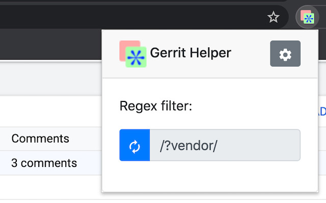
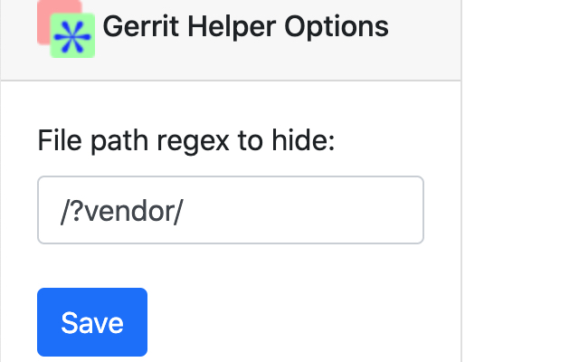

# gerrit-helper

## Description

Hide generated files (e.g. "vendor") on Gerrit based on regular expression.

Make code reviews faster and easier by hiding generated files (for example, "vendor" files in Go) that don't require human review. Gerrit Helper lets you define a custom filepath regex to toggle hiding files on any Gerrit changelist code review page.

## Screenshots

### Toolbar Action

### Options Page
